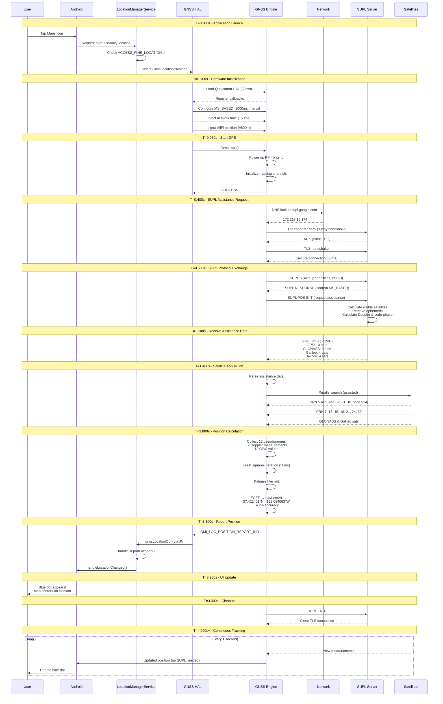

# Google Maps GPS Acquisition Flow

> Complete 3.3-second journey from tapping the Maps icon to seeing your blue dot

## Overview

This document traces the complete technical flow of how your phone acquires a GPS location when opening Google Maps. The example uses real-world parameters:

- **Location**: Google HQ (37.422°N, 122.084°W)
- **Device**: Snapdragon 888 phone
- **Network**: 4G LTE
- **Total Time**: 3.3 seconds to first fix

---

## Sequence Diagram

---

## Detailed Timeline

### Phase 1: Application Launch (T=0.000s to T=0.250s)

| Time | Event | Details |
|------|-------|---------|
| T=0.000s | User taps Maps icon | Android launches application |
| T=0.050s | LocationManagerService | Permission check: `ACCESS_FINE_LOCATION` ✓ Provider selection: GnssLocationProvider |
| T=0.100s | GNSS HAL initialization | JNI call to native code Load Qualcomm HAL (IGnss interface) Register callbacks |
| T=0.150s | Configure position mode | Mode: MS_BASED Recurrence: PERIODIC Interval: 1000 ms |
| T=0.200s | Inject assistance | Time: Network time ±50ms Location: Last WiFi position ±500m |
| T=0.250s | Start GPS | `IGnss.start()` called `QMI_LOC_START_REQ` sent to GNSS engine |

### Phase 2: SUPL Assistance (T=0.300s to T=1.100s)

| Time | Event | Details |
|------|-------|---------|
| T=0.300s | GNSS engine powers up | RF frontend ON Tracking channels initialized Response: SUCCESS |
| T=0.400s | DNS lookup | Resolve `supl.google.com` → 172.217.15.174 |
| T=0.450s | TCP connection | Connect to port 7275 3-way handshake (20ms RTT) |
| T=0.500s | TLS handshake | Certificate exchange Secure connection established (50ms) |
| T=0.600s | SUPL START | Send capabilities, cell ID Message: ~500 bytes |
| T=0.650s | SUPL RESPONSE | SLP acknowledges, confirms MS_BASED mode |
| T=0.700s | SUPL POS INIT | Request ephemeris, almanac, acquisition assistance |
| T=0.800s | Server generates assistance | Calculate visible satellites Retrieve ephemeris from reference network Calculate Doppler and code phase |
| T=1.100s | SUPL POS delivery | GPS: 10 satellites GLONASS: 6 satellites Galileo: 4 satellites BeiDou: 4 satellites Total: ~12 KB downloaded |

### Phase 3: Satellite Acquisition (T=1.400s to T=3.100s)

| Time | Event | Details |
|------|-------|---------|
| T=1.400s | GNSS engine receives assistance | Parse and store data Load acquisition parameters |
| T=1.450s | Satellite acquisition begins | Parallel search using assistance data |
| T=1.500s | First satellite acquired (PRN 5) | Expected: -2534 Hz, code 512 Found: -2531 Hz, code 514 ✓ |
| T=1.600s - T=2.500s | More satellites acquired | PRN 7, 13, 15, 18, 21, 24, 30 Plus GLONASS and Galileo satellites Total: 12 satellites tracked |
| T=3.000s | First measurement epoch | 12 pseudoranges 12 Doppler measurements 12 carrier phases 12 C/N0 values |
| T=3.050s | Position calculation | Load satellite positions Apply corrections Least squares (3-4 iterations) Kalman filter initialization ECEF → Lat/Lon/Alt Computation time: 50ms |
| T=3.100s | Position reported to Android | `QMI_LOC_POSITION_REPORT_IND` GNSS daemon → Location API → HAL `IGnssCallback.gnssLocationCb()` JNI → GnssLocationProvider |

**Calculated Position:**
- Latitude: 37.422401°N (error: -0.7m)
- Longitude: -122.084063°W (error: +0.5m)
- Altitude: 31.8 m
- Accuracy: ±4.2m (HDOP: 0.9)

### Phase 4: UI Update and Cleanup (T=3.150s to Done)

| Time | Event | Details |
|------|-------|---------|
| T=3.150s | Framework processes location | `GnssLocationProvider.handleReportLocation()` `LocationManagerService.handleLocationChanged()` Create Location object |
| T=3.200s | Location delivered to Maps | LocationListener callback Executed on Maps' main thread |
| T=3.250s | Maps updates UI | **Blue dot appears!** Map centers on your location "Your location" marker |
| T=3.300s | SUPL session terminates | SUPL END sent TLS connection closed |
| T=4.000s onwards | Subsequent fixes | Every 1 second: new position No SUPL needed (ephemeris valid 4 hours) Each fix: ~100ms measurement → callback |

---

## Key Components

### Software Stack
- **Android Framework**: LocationManagerService, GnssLocationProvider
- **HAL Layer**: Hardware Abstraction Layer (IGnss interface)
- **GNSS Engine**: Qualcomm GNSS firmware
- **Application**: Google Maps with LocationListener

### Network Protocol
- **SUPL (Secure User Plane Location)**: Protocol for A-GPS assistance
- **Server**: supl.google.com:7275
- **Transport**: TCP + TLS 1.2
- **Payload**: ~12 KB assistance data

### Satellite Systems
- **GPS**: 10 satellites tracked
- **GLONASS**: 6 satellites tracked
- **Galileo**: 4 satellites tracked
- **BeiDou**: 4 satellites tracked
- **Total**: 12 satellites used for position fix

---

## Performance Metrics

| Metric | Value |
|--------|-------|
| Time to First Fix (TTFF) | 3.3 seconds |
| Network Data Used | ~12 KB |
| Position Accuracy | ±4.2 meters |
| Horizontal Dilution of Precision (HDOP) | 0.9 (excellent) |
| Update Rate | 1 Hz (after first fix) |
| Ephemeris Validity | 4 hours |

---

## Notes

- **MS_BASED Mode**: Mobile Station Based - the phone calculates its own position using assistance data from the server
- **Cold Start**: This timeline assumes no valid ephemeris data cached on the device
- **Warm Start**: If ephemeris is cached, TTFF can be < 1 second (skips SUPL phases)
- **Hot Start**: If recent fix exists, TTFF can be < 0.5 seconds

---

## References

- Android GNSS HAL Documentation
- SUPL Protocol Specification (OMA-TS-ULP-V2_0_4)
- GPS Interface Control Document (IS-GPS-200)
- Qualcomm Location Suite Documentation